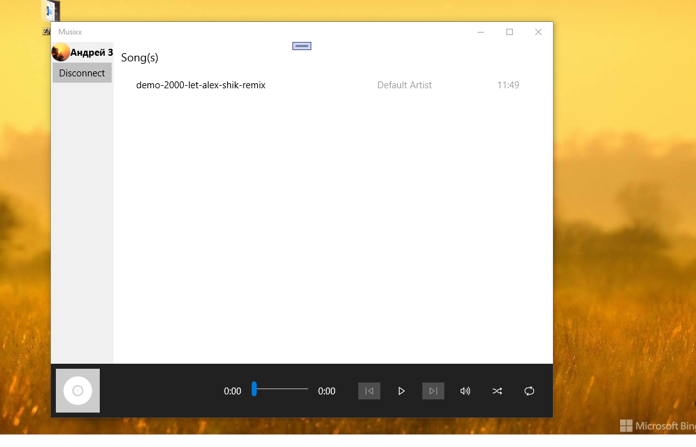

# Musixx-1 ("FamilyHub" codename)

An attempt to create simple family music organizer app built with UWP philosophy, 
utilizing google's firebase realtime database for the backend, and... Google Drive :)

## Screenshots

## Features
* Authentication with Google email and password (GDrive connection)
* Music files list (show of mp3 only now)

## Great problems
1. Music Player demaged (meta tag parsing bugs, etc..)
2. Win10Mobile G-Grive auth partially failed... some real mobile debugging needed!

## Plans
* Push notifications
* Family Chat
* Sync Scheduler (Home PC/ Family devices)

## Before re-compiling the sources / your RnD

Register (and do tuning) your own Google's "backend": https://console.developers.google.com/ (Console API)
Actualize client_secret.json file (in Resources directory)

-- [m][e] 2022

